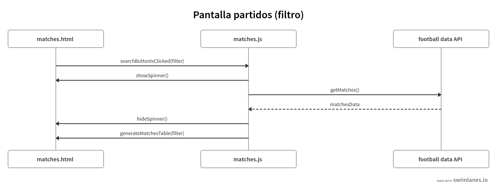
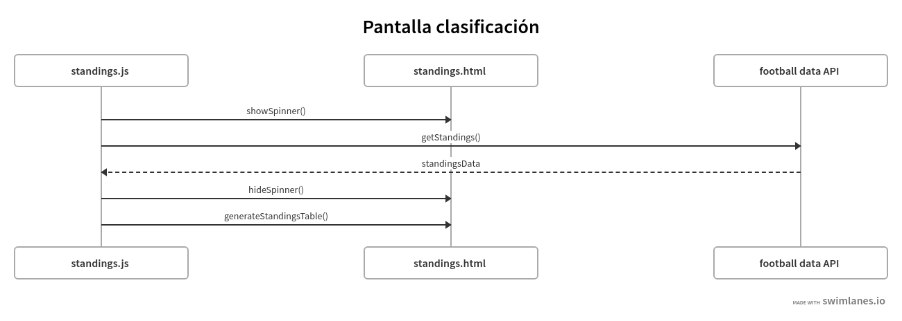

#Proyecto 2

Este proyecto consiste en una página web desde la cual se pueden consultar tanto los partidos como la clasificación de La Liga española de futbol profesional en la temporada actual.

La pagina ofrece las siguientes funcionalidade:
- Consultar el resultado, la fecha, hora de todos los partidos de la temporada actual, además de la jornada a la que pertenecen.
- Filtrar los partidos por nombre del equipo.
- Consultar la tabla de clasificación de la temporada actual

##Tecnologias empleadas : 
- HTML : Empleado para el esqueleto de la página.
- CSS3 y Bootstrap : Empleado para diseño de la interfaz.
- Javascript : Empleado para la obtención de datos, tratamiento de los mismos y lógica de la página. 

##Descripcion técnica del proyecto:

El proyecto se compone de dos pamtallas: Partidos y Clasificación. Ambas pantallas realizan una petición HTTP GET a la API de [football-data.org](https://www.football-data.org/)

A continuación se muestran dos diagramas que reflejan la interacción entre ambas pantallas y la API de de football-data.org.

##Versiones:
1.0 - 18-11-2021

##Tareas pendientes de realizar : 
- Arreglar bug visual en la carga de partidos (contracción del header de la tabla) 
- Mostrar más datos sobre los partidos
- Aplicar animación de icono "LIVE" para aquellos partidos que están siendo jugados en el presente.
- Código de colores para la tabla de clasificación (indicar aquellos que están con posibilida de descenso, aquellos que entrarían para competir en champions y europa league en la siguiente temporada)
- Implementar más filtros y filtros de ordenación en la pantalla Partidos.
